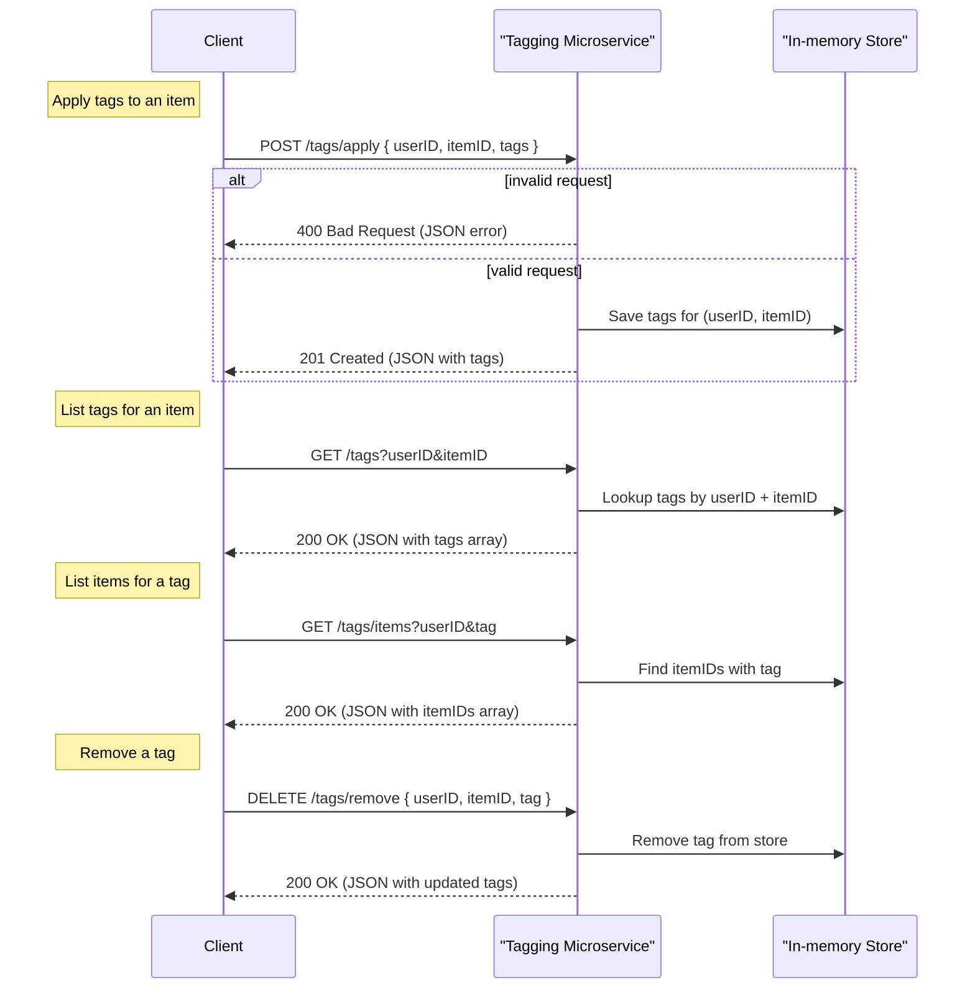

# Tagging Microservice

CS361 – Group 22  
Tagging microservice for the Big Pool (Milestone 3).

This microservice allows another program to:
- Attach text tags to items for a specific user
- List all tags for an item
- List all items that share a given tag
- Remove a single tag from an item

The service uses an in-memory data store.

---

## How to Run

1. Install dependencies:

```bash
npm install
```

2. Start the microservice:

```bash
npm start
```

You should see something like:

```text
Tagging Microservice running on http://localhost:5002
```

Leave this terminal running while you test or while an external program calls the microservice.

---

## Communication Contract

The microservice communicates over HTTP using JSON.  
Base URL (default): `http://localhost:5002`

### 1. Apply Tags to an Item

**Endpoint**

```text
POST /tags/apply
```

**Request Headers**

- `Content-Type: application/json`

**Request Body Example**

```json
{
  "userID": "u1",
  "itemID": "item123",
  "tags": ["Kitchen", "Fragile"]
}
```

**Example Successful Response (201 Created)**

```json
{
  "status": "success",
  "message": "Tags applied to item",
  "data": {
    "userID": "u1",
    "itemID": "item123",
    "tags": ["Kitchen", "Fragile"]
  }
}
```

If the request is missing `userID`, `itemID`, or `tags`, the microservice returns:

```json
{
  "status": "error",
  "message": "Missing userID, itemID, or tags"
}
```

---

### 2. List Tags for an Item

**Endpoint**

```text
GET /tags?userID=u1&itemID=item123
```

**Example Code (client-side)**

```js
const tagsResponse = await axios.get("http://localhost:5002/tags", {
  params: { userID: "u1", itemID: "item123" }
});

console.log(tagsResponse.data);
```

**Example Successful Response (200 OK)**

```json
{
  "status": "success",
  "data": {
    "userID": "u1",
    "itemID": "item123",
    "tags": ["Kitchen", "Fragile"]
  }
}
```

If the item has no tags, `tags` will be an empty array.

---

### 3. List Items for a Tag

**Endpoint**

```text
GET /tags/items?userID=u1&tag=Kitchen
```

**Example Code**

```js
const itemsResponse = await axios.get("http://localhost:5002/tags/items", {
  params: { userID: "u1", tag: "Kitchen" }
});

console.log(itemsResponse.data);
```

**Example Successful Response (200 OK)**

```json
{
  "status": "success",
  "data": {
    "userID": "u1",
    "tag": "Kitchen",
    "itemIDs": ["item123", "item999"]
  }
}
```

If there are no items with that tag for the user, `itemIDs` will be an empty array.

---

### 4. Remove a Tag from an Item

**Endpoint**

```text
DELETE /tags/remove
```

**Request Headers**

- `Content-Type: application/json`

**Request Body Example**

```json
{
  "userID": "u1",
  "itemID": "item123",
  "tag": "Fragile"
}
```

**Example Code**

```js
const removeResponse = await axios.delete("http://localhost:5002/tags/remove", {
  data: {
    userID: "u1",
    itemID: "item123",
    tag: "Fragile"
  }
});

console.log(removeResponse.data);
```

**Example Successful Response (200 OK)**

```json
{
  "status": "success",
  "message": "Tag removed from item",
  "data": {
    "userID": "u1",
    "itemID": "item123",
    "tags": ["Kitchen"]
  }
}
```

If the tag was not present on the item, the response is still `status: "success"` but the message indicates that nothing changed.

---

## UML Sequence Diagram

Below is a sequence diagram showing the interaction between a client and the Tagging Microservice:



---

## Test Program

A simple Node test client is included: `test_tagging_client.js`.

Run it in a separate terminal (with the microservice already running):

```bash
node test_tagging_client.js
```

It will:
1. Apply tags to an item
2. List tags for that item
3. List items that have a specific tag
4. Remove a tag from the item

---
